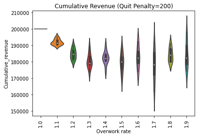
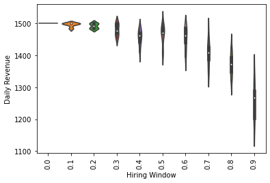
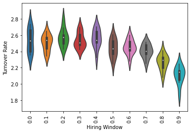

# Mini-Project 3: Overworking and Long-term Sustainability

Jinfei Zhu

## Research question

What is the relationship between overworking and the company's long-term profits?

## Introduction
In this interactive game, players are the boss of a company. Our goal is to study the effects of overworked agents as both decision-makers and decision-takers. We are interested in understanding how different corporate cultures / managerial styles have an impact on long-term and short-term interests, and the effects of these factors on the success of the company and the wellbeing of the employees. 

In this game, players can choose to set overworking parameters that vary from two types of initial values, 8-hour working and 16-hour working. These are two extreme endpoints and players of this game could set any parameter between these two cases.

## Literature Review

Overworking is not only a modern thing. There are three main stages of development in working hours since the 1800s: gradual reduction, stabilization, and then polarization (Golden, Lonnie, 2009). During the initial transformation from agricultural to industrial jobs and workplaces, many workers worked up to 70 hours per week or more and have reached its peak by 1830. Over the 19th century, the working hours gradually declined. By the 1920s, the average working hours was about 48 hours and gradually became stable for a workweek schedule. In the last few decades, working hours become more polarized. The new group of working 50 or more hours per week has been characterized as highly educated, high-wage, salaried, and older-aged workers. (Drago et al., 2005; Kuhn and Lozano, 2006)

This recent rise in the prevalence is a first in a long-time declining working hour trend. Why employees are working extra hours? It could be triggered by a set of rewards such as earning a bonus or raise within one's position, winning promotion to a better one, signaling to the labor market that one is productive or ambitious and thus securing a better job in another firm, acquiring extra skills (or networks, or contracts) that may be rewarded in either the current firm or another one (Kuhn, 2006).

However, overworking has caused many problems. Karoshi, death from over-work, is related to long overtime at work, on duty in holidays, attending a new job with no family members around, and working at night shift(Ke, 2012). This overworking new normal also eats up leisure and family time.

So to sum up, the reasons for overtime working are primarily two: the demands of companies and employees' willingness to earn rewards. In this paper, I will focus on the employer's demand side. In the employee's perspective, is pushing company employees to work more time do help the success of the company? Usually, when analyzing similar problems, surveys are conducted to workers and real operation and company revenue data are collected. However, the python package mesa is a handy tool for simulation, helping us observe the company's metrics.

## Methods

### ABM Self-Running Rules
In this model, agents are on the mesa grid at the beginning of this game. Each timestep they provide daily profits to this company at a certain efficiency rate. They also have a happiness level. When the player chooses a strict working policy, their efficiency increase (though in reality working overtime may make efficiency decrease, but as the total working hour increase, their total outcome still increases). However, when their happiness level is lower than 0, they would exit this company. It takes time and money for the company to hire new employees (drawbacks of high turnover rate). 

### Input

#### Model Input

- `overwork_rate` (float, default=1.5): Overworking multiplier. The original working time is 1, we would assume this is an 8-hour working standard each day, and `1 <= overwork_rate <= 2` (which means working 8 hours to 16 hours per day). This rate is determined by the player at the start of the game.
- `happiness_drop_rate` (float, randomly generated in [0, 0.2]): Happiness level decreasing rate . The initial level of happiness is 1. It drops by `happiness_drop_rate * overwork_rate`. Now this rate is randomly generalized for different employees, reflecting the reality that we also have different types of workers in real life, that some workers (workaholism) are more indifferent to work overtime while others don't. This value is initialized as `0 < happiness_drop_rate < 0.2`. When the happiness level is below 0, the employee quit and the cell in the grid is empty.
- `hiring_window` (int, default=10): Hiring window, the number of time steps that it takes a company to hire a new employee when there is an opening. During this time there is no revenue gained by lost workers. 
- `height` and `width` (int, default=10): the size of the grid
- `n_worker`(int, default=100): The number of workers a company needs to have. Because in this simulation, agents don't move. So the number of agents is actually the size of the grid. For example, n_worker=100 when height=width=10.
- `quit_penalty`(int, default=20): every time a worker quit, there is a loss of revenue

Note: At first, I am planning to set a fixed hiring window for each cell, so when an employee quits, after a fixed timestep (for example, 5 days later), there will be a new employee coming to that position for sure. However, this requires I give the position in the grid an attribute that states the timestep that allows new hiring to happen. After some search, this would require another agent attached to the grid. But I think it's not necessary to add a new type of agent just for this small function. And in real life, hiring is not happening for sure - it costs a company an uncertain time to find the person they want. So I just set the hiring window as a threshold, say `0.8`. If a random number is larger than this random number, the company can hire a new employee for the empty spot.

#### Agent Input

- `happy`: initial happy level
- `earning_rate`(int, default=10). Workers' efficiency, each time step the amount of revenue. A company's daily revenue = `current_worker * earning_rate`

#### Metrics of model

- `daily_revenue`(int)Company daily profit:  = `current_worker * earning_rate`
- `cumulative_revenue`(int): Company cumulative profit, the summation of all revenues 
- `turnover_rate` (float): The number of employees left over the number of time steps. 
- `current_worker`(int, max=`n_worker`): current number of employees 

### Incentive for employers to increase working time
- Daily revenue increase, and therefore cumulative revenue increases too.

### Punishment of increased working time
- High turnover rate penalty
- Left workers don't generate revenue for the company before new workers come

## Result

### The influence of overwork rate

#### Cumulative Revenue

Though my model is a simplified simulation of real life, the result can be very intuitive. It shows that when there is no overwork, the cumulative revenue doesn't vary. However, when employees are pushed to overwork, the variance increases and the expectation decreases.

However, this result is highly relative to the quit penalty. If the value is set to 50 instead of 200 (while each worker works each day can generate 10 unit revenue), we can find that the higher the overwork rate, the higher the revenue.

#### Daily Revenue

When analyzing the daily revenue and overwork rate, they are still positively related.

#### Turnover Rate

This is a kind of validity test to see if my model runs correctly. If my model predicts the turnover rate will increase when the overwork rate increase, I think it's correct and similar to our real life.

#### Number of Current Workers 

Like the above test, as the overwork rate increase, the number of current workers decreases.

### The Influence of Hiring Window

Hiring windows reflects the difficulty to hire a new employee when the former worker quits. We did similar tests on 4 different metrics.

#### Cumulative Revenue

When the hiring window is less than or equal to 0.4, the cumulative revenue doesn't change much. Only after 0.5, this cost becomes more and more significant. The side effect on cumulative inverse is also getting obvious

#### Daily Revenue

Like the cumulative revenue, the daily revenue decreases when the hiring becomes difficult. 

#### Turnover Rate

As the hiring window increase, the turnover rate doesn't have a significant change for the hiring window smaller than 0.7, indicating that the hiring window doesn't change the turnover rate. However, when hiring is extremely hard - it's hard to find a person to join this company, the turnover rate decrease since the number of employees staying in the company is not as high as the company is welcoming different people.

#### Current Worker

As the hiring window increase, the number of current workers doesn't change before 0.8. Only when the hiring window is 0.9, the expectation decreases and variance increases significantly.

## Discussion

In this implementation, I didn't consider the possibility of growth of the company and wage increase. When the company grows, managers can make decisions to hire more workers, or raise wages. In each scenario, a set of pre-designed policy choices are provided. If the company grows but they don’t hire more workers, each worker would have to work a long time, resulting in overworking. This will further have an impact on workers' happiness level along with overworking. Workers compare their wages to the value they produce, affecting their happiness/motivation. So there would be two sources of decrease of happiness level: working overtime and feeling be treated unfairly.

This kind of study could also take the advantage of reinforcement learning, by giving employees rewards when they work overtime, adding workaholism to this pure "employer-led" working overtime.

## Reference

Golden, Lonnie. “A Brief History of Long Work Time and the Contemporary Sources of Overwork.” Journal of Business Ethics 84, no. 2 (January 1, 2009): 217–27. https://doi.org/10.1007/s10551-008-9698-z.

Drago, R., D. Black and M. Wooden: 2005, The Existence and Persistence of Long Hours. IZA Discussion Paper No. 1720, Bonn Germany, August.

Epstein, C. F. and A. Kalleberg: 2004, Fighting for Time: Shifting Boundaries of Work and Social Life (Russell Sage Foundation, New York).

Kuhn, P. and F. Lozano: 2006, The Expanding Workweek? Understanding Trends in Long Work Hours among U.S. Men, 1979–2004. IZA Discussion Paper No. 1924, Berlin.

Ke, Der-Shin. “Overwork, Stroke, and Karoshi-Death from Overwork” 21, no. 2 (2012): 6.

Agent die: https://dadaromeo.github.io/posts/mesa-a-library-for-agent-based-modeling-in-python/

Scheduler: https://mesa.readthedocs.io/en/stable/apis/time.html#mesa.time.BaseScheduler

Add resource agent to the grid: https://groups.google.com/g/projectmesa/c/_yemKEad5qo?pli=1

